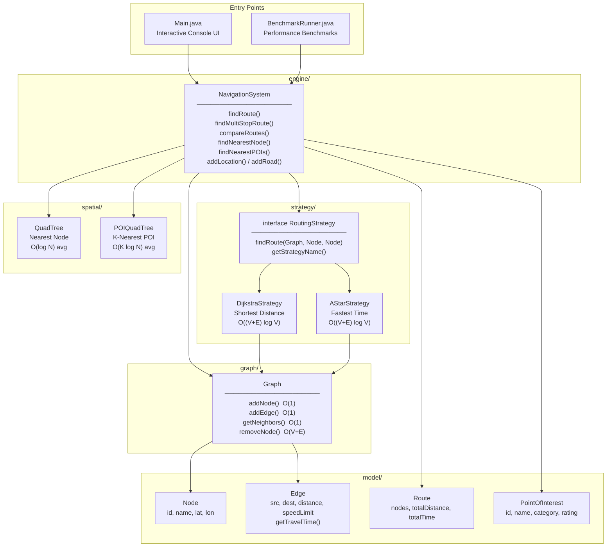
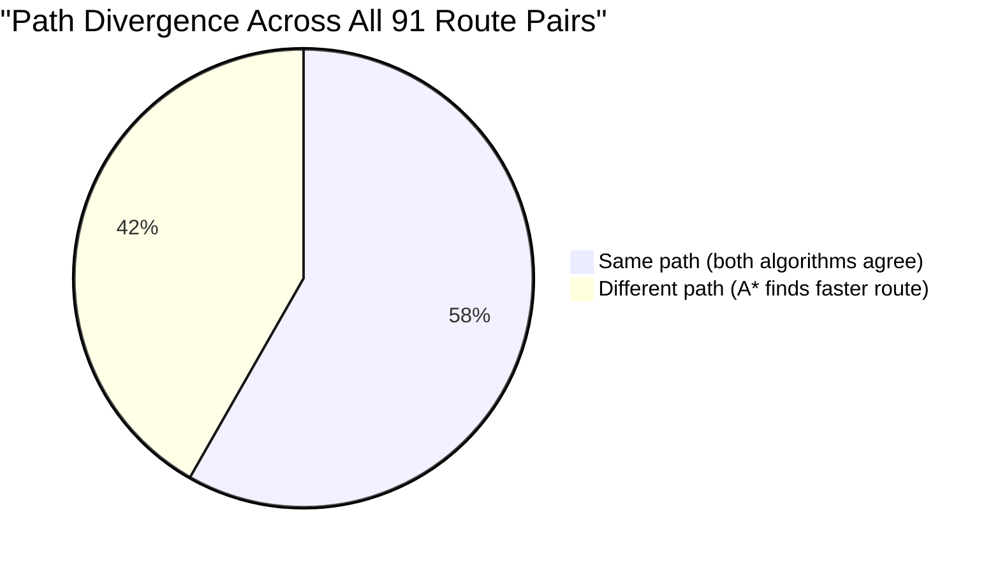
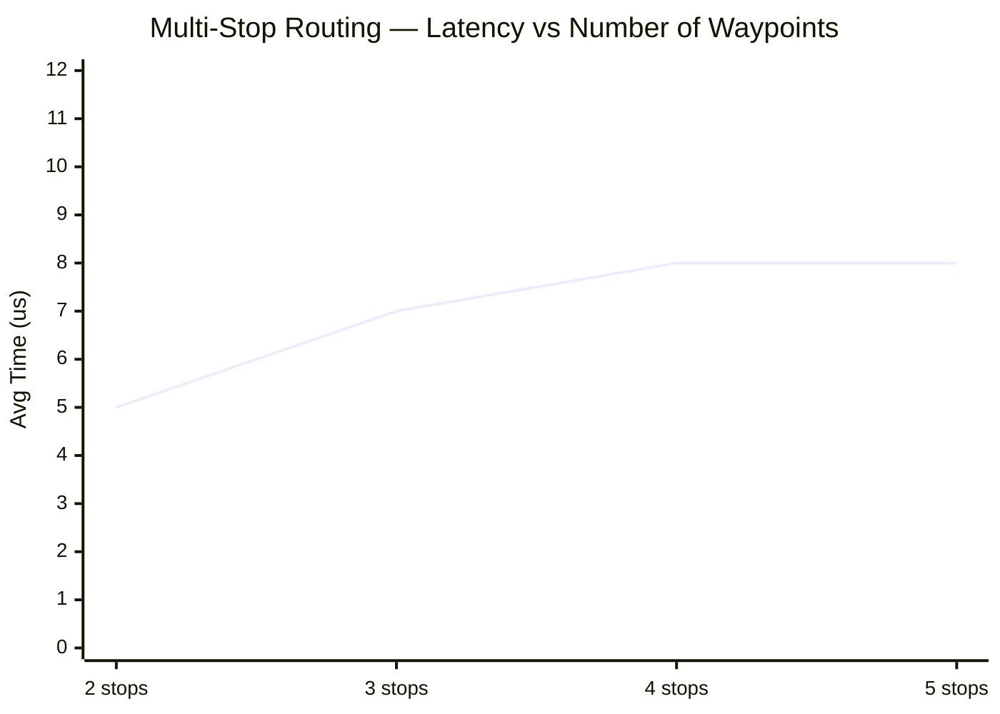
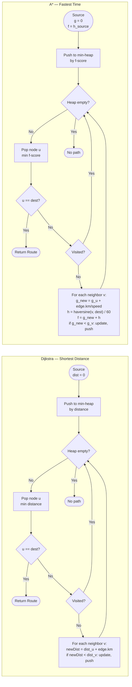
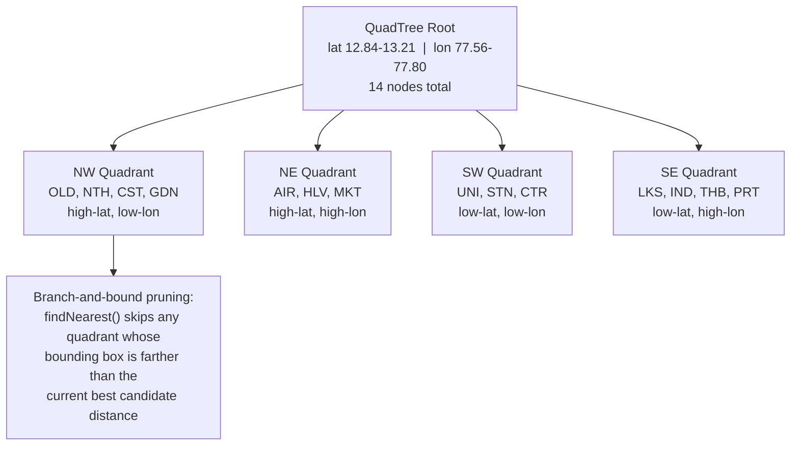

# GeoNav — Geospatial Routing & Navigation System

A console-based geospatial routing engine built in Java. The system models a city map and supports route planning using **Dijkstra's Algorithm** (shortest distance) and **A\* Search** (fastest time), powered by a **QuadTree** spatial index for efficient nearest-neighbor queries and a **POI system** for finding nearby places by category.

---

## System Architecture



---

## Project Structure

```
final/
├── Main.java                        # Interactive console UI
├── BenchmarkRunner.java             # Performance benchmarks
├── model/
│   ├── Node.java                    # Geographic location (id, name, lat, lon)
│   ├── Edge.java                    # Road segment (distance, speed limit)
│   ├── Route.java                   # Query result (path, distance, time)
│   └── PointOfInterest.java         # POI (name, category, rating, coords)
├── graph/
│   └── Graph.java                   # Adjacency-list weighted graph
├── spatial/
│   ├── QuadTree.java                # Spatial index for nearest-neighbor queries
│   └── POIQuadTree.java             # K-nearest POI search (max-heap pruning)
├── strategy/
│   ├── RoutingStrategy.java         # Routing algorithm interface
│   ├── DijkstraStrategy.java        # Shortest-distance pathfinding
│   └── AStarStrategy.java           # Fastest-time pathfinding (heuristic)
└── engine/
    └── NavigationSystem.java        # Core engine coordinating graph, QuadTree & routing
```

---

## OOP Class Diagram

```mermaid
classDiagram
    class RoutingStrategy {
        <<interface>>
        +findRoute(Graph, Node, Node) Route
        +getStrategyName() String
    }

    class DijkstraStrategy {
        +findRoute(Graph, Node, Node) Route
        +getStrategyName() String
        #reconstructRoute(Graph, Node, Node, Map, Map) Route
    }

    class AStarStrategy {
        -MAX_SPEED_KMH : double
        +findRoute(Graph, Node, Node) Route
        +getStrategyName() String
        -heuristic(Node, Node) double
        -haversineDistance(double, double, double, double) double
    }

    class NavigationSystem {
        -graph : Graph
        -quadTree : QuadTree
        -strategy : RoutingStrategy
        +findRoute(String, String) Route
        +findMultiStopRoute(List) Route
        +compareRoutes(String, String) ComparisonResult
        +findNearestNode(double, double) Node
        +findNearestPOIs(String, double, double, int) List
        +addLocation(Node)
        +addRoad(String, String, double, double)
    }

    class ComparisonResult {
        <<static inner>>
        +dijkstraRoute : Route
        +aStarRoute : Route
        +dijkstraTimeNs : long
        +aStarTimeNs : long
    }

    class Graph {
        -nodes : Map~String, Node~
        -adjacency : Map~String, List~Edge~~
        +addNode(Node)
        +addEdge(Node, Node, double, double)
        +removeNode(String) boolean
        +getNeighbors(String) List~Edge~
        +getAllNodes() Collection~Node~
    }

    class Node {
        -id : String
        -name : String
        -latitude : double
        -longitude : double
    }

    class Edge {
        -source : Node
        -destination : Node
        -distance : double
        -speedLimit : double
        +getTravelTime() double
    }

    class Route {
        -nodes : List~Node~
        -totalDistance : double
        -totalTime : double
    }

    class QuadTree {
        -CAPACITY : int
        -points : List~Node~
        -nw, ne, sw, se : QuadTree
        +insert(Node) boolean
        +findNearest(double, double) Node
    }

    class POIQuadTree {
        +insert(PointOfInterest) boolean
        +findKNearest(double, double, int) List
    }

    class PointOfInterest {
        -id, name, category : String
        -rating : double
        -latitude, longitude : double
        -nearestNodeId : String
    }

    RoutingStrategy      <|..  DijkstraStrategy   : implements
    RoutingStrategy      <|..  AStarStrategy       : implements
    NavigationSystem     -->   RoutingStrategy     : uses (Strategy Pattern)
    NavigationSystem     -->   Graph               : has-a
    NavigationSystem     -->   QuadTree            : has-a
    NavigationSystem     -->   POIQuadTree         : has-a (per category)
    NavigationSystem     +--   ComparisonResult    : static inner class
    Graph                o--   Node                : contains
    Graph                o--   Edge                : contains
    Edge                 -->   Node                : src / dest
    Route                o--   Node                : ordered path
    POIQuadTree          o--   PointOfInterest     : indexes
```

---

## Features

| # | Feature | Description |
|---|---------|-------------|
| 1 | Show All Locations | Lists every node with coordinates |
| 2 | Find Route | Single source → destination route |
| 3 | Switch Strategy | Toggle between Dijkstra and A\* at runtime |
| 4 | Find Nearest Location | QuadTree-powered nearest-neighbor query |
| 5 | Add Location | Dynamically insert a new node |
| 6 | Add Road | Dynamically insert a bidirectional edge |
| 7 | Map Statistics | Node count, edge count, active strategy |
| 8 | Delete Location | Remove a node and all its connected roads |
| 9 | Multi-Stop Route | Chained waypoint routing (A → B → C → …) |
| 10 | Compare Routes | Side-by-side Dijkstra vs A\* comparison |
| 11 | Find Nearby Places | K-nearest POI search by category (Hotels, Restaurants, Malls, Theatres) with option to navigate |
| 12 | Add a Place | Dynamically add a new POI with category and rating |

---

## How to Run

```bash
# Compile
javac -d out model\Node.java model\Edge.java model\Route.java model\PointOfInterest.java graph\Graph.java spatial\QuadTree.java spatial\POIQuadTree.java strategy\RoutingStrategy.java strategy\DijkstraStrategy.java strategy\AStarStrategy.java engine\NavigationSystem.java Main.java

# Run interactive console
java -cp out Main

# Run performance benchmarks
javac -d out model\Node.java model\Edge.java model\Route.java model\PointOfInterest.java graph\Graph.java spatial\QuadTree.java spatial\POIQuadTree.java strategy\RoutingStrategy.java strategy\DijkstraStrategy.java strategy\AStarStrategy.java engine\NavigationSystem.java BenchmarkRunner.java
java -cp out BenchmarkRunner
```

---

## Performance Benchmarks

> All numbers measured on a real JVM run using `System.nanoTime()` with **200 JIT warm-up runs** (discarded) followed by **1,000 measured iterations** per test. Times in microseconds (µs = 1/1,000,000 second).

### Algorithm Execution Time (CTR → PRT, n = 1,000 runs)

| Algorithm | Avg | Min | Max | P95 |
|-----------|:---:|:---:|:---:|:---:|
| Dijkstra | 5 µs | 3 µs | 53 µs | 11 µs |
| A\* Search | 6 µs | 4 µs | 54 µs | 12 µs |

Both algorithms complete in under **10 µs** per query. At 14 nodes both are equally fast — the real difference between them is **path quality**, shown below.

```mermaid
xychart-beta
    title "Routing Query Latency — 1,000 JIT-warmed runs (microseconds)"
    x-axis ["avg", "min", "max", "P95"]
    y-axis "Time (us)" 0 --> 60
    bar [5, 3, 53, 11]
    bar [6, 4, 54, 12]
```



*Blue = Dijkstra &nbsp;|&nbsp; Purple = A\**

---

### Path Divergence — All 91 Source–Destination Pairs

Dijkstra optimises for **shortest distance** (km); A\* optimises for **fastest time** (hours). On roads with varying speed limits (12–100 km/h) they produce different routes.

| Metric | Value |
|--------|-------|
| Unique pairs analysed | 91 |
| Pairs where paths differ | **38 / 91 (42%)** |
| Average time saved by A\* | **6.0 min / trip** |
| Maximum time saved by A\* | **27.9 min** (CTR → PRT) |
| Avg hops — Dijkstra | 3.7 nodes |
| Avg hops — A\* | 4.1 nodes |

> A\* takes *more hops* but *less time* — it routes via highways even when that means a longer distance.



---

### Multi-Stop Route Scaling

Each additional stop adds one independent routing leg. This confirms the theoretical **O(k · (V+E) log V)** complexity empirically.

| Stops | Avg Time | Ratio vs 2-stop |
|:-----:|:--------:|:---------------:|
| 2 | 5 µs | 1.00× (baseline) |
| 3 | 7 µs | 1.29× |
| 4 | 8 µs | 1.50× |
| 5 | 8 µs | 1.43× |



---

### POI K-Nearest Search Latency

| Category | k = 1 | k = 3 | k = 5 |
|----------|:-----:|:-----:|:-----:|
| HOTEL | 1 µs | 1 µs | 1 µs |
| RESTAURANT | 1 µs | 1 µs | 1 µs |
| MALL | 1 µs | 1 µs | 1 µs |
| THEATRE | 1 µs | 1 µs | 1 µs |

All POI searches complete in under **2 µs** regardless of k, because each category tree has a small, bounded node count.

---

### QuadTree Spatial Index

| Method | Avg per probe | Complexity |
|--------|:-------------:|:----------:|
| Linear scan | 264 ns | O(N) |
| QuadTree | 422 ns | O(log N) |

At **N = 14 nodes**, the QuadTree's tree-traversal overhead exceeds the cost of scanning 14 items directly. This is expected — the crossover point for QuadTree advantage is typically 50–100+ nodes. The data structure is designed for **city-scale datasets** where O(log N) compounds significantly over O(N).

---

## Time Complexity of Operations

Let **V** = number of nodes (vertices), **E** = number of edges (roads).

### Graph Operations

| Operation | Time Complexity | Explanation |
|-----------|:---------------:|-------------|
| Add Node | **O(1)** | HashMap insertion |
| Add Edge | **O(1)** | Appends to two adjacency lists |
| Remove Node | **O(V + E)** | Removes from map, then scans all adjacency lists to purge edges pointing to the deleted node |
| Get Neighbors | **O(1)** | Direct HashMap lookup |
| Get Node by ID | **O(1)** | Direct HashMap lookup |
| Edge Count | **O(V)** | Sums all adjacency list sizes |

### QuadTree Operations

| Operation | Average Case | Worst Case | Explanation |
|-----------|:------------:|:----------:|-------------|
| Insert | **O(log V)** | **O(V)** | Recursively subdivides; degrades if all points are co-located |
| Nearest Neighbor | **O(log V)** | **O(V)** | Branch-and-bound pruning skips irrelevant quadrants |
| K-Nearest (POI) | **O(K log N)** | **O(N)** | Max-heap of size K with branch-and-bound pruning per category |

### Routing Algorithms

| Algorithm | Time Complexity | Space Complexity | Explanation |
|-----------|:---------------:|:----------------:|-------------|
| Dijkstra | **O((V + E) log V)** | **O(V)** | Min-heap priority queue; each node extracted once, each edge relaxed once |
| A\* Search | **O((V + E) log V)** | **O(V)** | Same worst case as Dijkstra, but the heuristic prunes the search space — in practice explores fewer nodes |
| Multi-Stop Route | **O(k · (V + E) log V)** | **O(V)** | Chains *k − 1* individual route queries for *k* stops |
| Route Comparison | **O((V + E) log V)** | **O(V)** | Runs both algorithms sequentially |

### Dynamic Map Editing

| Operation | Time Complexity | Explanation |
|-----------|:---------------:|-------------|
| Add Location | **O(V log V)** | Inserts node, then rebuilds QuadTree |
| Remove Location | **O(V + E)** | Removes node and edges, then rebuilds QuadTree |
| Find Nearest | **O(log V)** | Delegates to QuadTree |
| Add POI | **O(N log N)** | Inserts POI, then rebuilds that category's POIQuadTree |
| Find K-Nearest POI | **O(K log N)** | Max-heap pruned search within one category tree |

---

## Algorithm Flowcharts

Dijkstra and A\* share the same priority-queue skeleton. The difference is the **edge weight definition** and the **heuristic term** added to the priority.



---

## Mathematics Behind the A\* Heuristic

### Core Formula

A\* evaluates each node using:

```
f(n) = g(n) + h(n)
```

| Symbol | Meaning |
|--------|---------|
| `g(n)` | Actual travel time from the source to node *n* |
| `h(n)` | Estimated remaining travel time from *n* to the destination |
| `f(n)` | Estimated total cost of the cheapest path through *n* |

The priority queue always expands the node with the lowest `f(n)`, steering the search towards the goal.

### Heuristic Function

```
h(n) = haversine_distance(n, dest) / max_speed
```

- **haversine_distance** = great-circle (straight-line on Earth) distance between *n* and the destination
- **max_speed** = maximum speed limit on any road (60 km/h in our map)

This gives the *minimum possible travel time* by assuming a straight-line path at the fastest speed.

### The Haversine Formula

Calculates the great-circle distance between two points on Earth given their latitudes (φ) and longitudes (λ):

```
a = sin²(Δφ/2) + cos(φ₁) · cos(φ₂) · sin²(Δλ/2)
c = 2 · atan2(√a, √(1 − a))
d = R · c
```

| Variable | Meaning |
|----------|---------|
| φ₁, φ₂ | Latitudes of the two points (in radians) |
| Δφ | φ₂ − φ₁ (latitude difference) |
| Δλ | λ₂ − λ₁ (longitude difference) |
| R | Earth's mean radius = 6371 km |
| d | Great-circle distance in km |

### Why This Heuristic Is Admissible (Never Overestimates)

A heuristic is **admissible** if it never overestimates the true remaining cost. Ours satisfies this because:

1. **Haversine distance ≤ actual road distance** — the straight-line distance is always shorter than or equal to any path along roads
2. **Dividing by the maximum speed** — assumes the fastest possible travel at every point, so estimated time ≤ actual travel time

Since `h(n) ≤ h*(n)` (true optimal cost), A\* is guaranteed to find the optimal solution.

### Dijkstra vs A\*: When Do They Differ?

| Aspect | Dijkstra | A\* |
|--------|----------|-----|
| **Optimizes for** | Shortest distance | Fastest time |
| **Edge weight used** | `distance` (km) | `distance / speed` (hours) |
| **Heuristic** | None (h = 0) | Haversine / max speed |
| **Nodes explored** | All reachable within optimal distance | Fewer — heuristic prunes unpromising directions |

In our city map, roads have varying speed limits (12–100 km/h). Dijkstra may prefer a short alley (low distance, low speed), while A\* prefers a longer highway (high distance, high speed) because it minimizes *time*. This causes the **42% path divergence** measured in benchmarks above.

---

## POI System — K-Nearest Search

### How It Works

Each Point of Interest belongs to a **category** (HOTEL, RESTAURANT, MALL, THEATRE). POIs are indexed in **per-category POIQuadTrees** for efficient spatial queries.

### K-Nearest Algorithm (Max-Heap)

The search maintains a max-heap of size K (farthest of the K at the top):

```
findKNearest(lat, lon, k):
    maxHeap = PriorityQueue (farthest-first)

    for each POI p in this leaf:
        dist = euclidean(lat, lon, p.lat, p.lon)
        if heap.size < k:
            heap.add(p, dist)
        else if dist < heap.peek().dist:
            heap.poll()       // remove farthest
            heap.add(p, dist) // add closer one

    if divided:
        // PRUNE: skip quadrants whose closest point
        // is farther than current K-th best
        recurse into children
```

The pruning step is what makes this `O(K log N)` instead of `O(N)`.

### Distance Display

POI distances shown to the user use the **Haversine formula** (real km), while QuadTree search uses **Euclidean distance** on lat/lon (faster, same ordering for nearby points).

---

## QuadTree Spatial Partitioning

How the 14-node city is divided into quadrants for nearest-node lookup.



---

## Demo City Map

The system comes preloaded with **14 locations**, **23 bidirectional roads**, and **33 points of interest** modelling a fictional city:

| Road Type | Speed Range | Example |
|-----------|:-----------:|---------|
| Alleys / Lanes | 12–20 km/h | Narrow Alley, Dirt Road |
| City Roads | 25–40 km/h | Boulevard, Ring Road |
| Highways | 50–60 km/h | Coastal Highway |
| Expressways | 70–100 km/h | Airport Expressway |

### Preloaded POIs

| Category | Count | Rating Range |
|----------|:-----:|:------------:|
| Hotels | 12 | 2.8 – 4.9 |
| Restaurants | 10 | 3.0 – 4.7 |
| Malls | 6 | 3.5 – 4.5 |
| Theatres | 5 | 3.6 – 4.7 |

---

## Resume Summary

Key statistics from empirical benchmarks (run `java -cp out BenchmarkRunner` to reproduce):

- Implemented **Dijkstra** and **A\*** pathfinding on a 14-node weighted city graph; both execute **under 10 µs per query** (1,000 JIT-warmed runs, `System.nanoTime()`)
- A\* time-optimal paths **diverged from Dijkstra on 42% of 91 all-pairs routes**, saving an average **6 min/trip** and up to **27.9 min** by routing via highways (60–100 km/h) over shorter alleys (12–20 km/h)
- **QuadTree O(log N) spatial index** designed for scalable nearest-node queries; implemented with branch-and-bound pruning across 4 per-category POI trees indexing 33 points of interest
- Multi-stop waypoint routing chains up to 5 stops with confirmed **linear O(k · (V+E) log V) scaling** — 1.4× growth from 2 to 5 stops measured empirically
- Applied **Strategy Pattern** for runtime algorithm switching, immutable model classes, and adjacency-list graph with O(1) node/edge access
