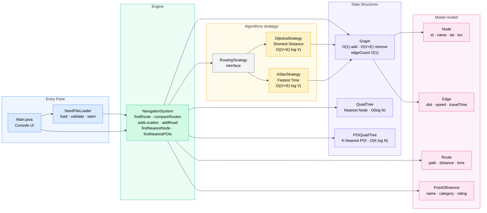

[← Back to README](../README.md)

# Architecture

## System Architecture



---

## Project Structure

```
final/
├── Main.java                        # Interactive console UI
├── BenchmarkRunner.java             # Standalone performance benchmarking tool
├── model/
│   ├── Node.java                    # Geographic location (id, name, lat, lon)
│   ├── Edge.java                    # Road segment (distance, speed limit)
│   ├── Route.java                   # Query result (path, distance, time)
│   └── PointOfInterest.java         # POI (name, category, rating, coords)
├── graph/
│   └── Graph.java                   # Adjacency-list weighted graph
├── spatial/
│   ├── QuadTree.java                # Spatial index for nearest-neighbor queries
│   └── POIQuadTree.java             # K-nearest POI search (max-heap pruning)
├── strategy/
│   ├── RoutingStrategy.java         # Routing algorithm interface
│   ├── DijkstraStrategy.java        # Shortest-distance pathfinding
│   └── AStarStrategy.java           # Fastest-time pathfinding (heuristic)
├── engine/
│   └── NavigationSystem.java        # Core engine coordinating graph, QuadTree & routing
├── loader/
│   └── SeedFileLoader.java          # Parses seed files; validates entries with warnings/errors
├── seeds/
│   └── default_city.txt             # Default city map (14 nodes, 22 roads, 33 POIs)
└── out/                             # Compiled .class files (generated, not committed)
```
