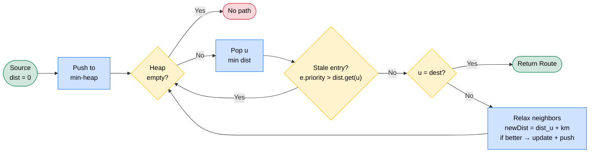
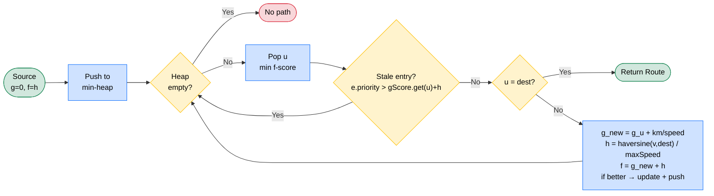

[← Back to README](../README.md)

# Algorithms

- [Overview](#overview)
- [Shared Implementation Skeleton](#shared-implementation-skeleton)
- [Dijkstra — Shortest Distance](#dijkstra--shortest-distance)
- [A\* — Fastest Time](#a--fastest-time)
- [Mathematics Behind the A\* Heuristic](#mathematics-behind-the-a-heuristic)
- [Admissibility & Consistency — Formal Proof](#admissibility--consistency--formal-proof)
- [Dijkstra vs A\*: When Do They Differ?](#dijkstra-vs-a-when-do-they-differ)
- [Why Divergence Grows With Graph Size](#why-divergence-grows-with-graph-size)
- [Complexity Derivation](#complexity-derivation)

---

## Overview

Both routing algorithms share **one priority-queue skeleton**. They differ in only two places:

| | Dijkstra | A\* |
|--|----------|-----|
| **Edge weight** relaxed | `edge.getDistance()` (km) | `edge.getTravelTime()` = km/speed (hours) |
| **Priority** in the heap | `g` (cumulative weight) | `f = g + h`, with `h` = Haversine heuristic |

Set `h = 0` and A\* *is* Dijkstra. That single term is what steers A\* toward the goal and prunes the frontier.

---

## Shared Implementation Skeleton

Both strategies run the same loop. Understanding it once explains both.

```
1. dist[v] = +∞ for all v         // best cost found to v so far
2. dist[src] = 0
3. push (src, priority) into a min-heap
4. while heap not empty:
5.     pop the entry with the smallest priority → node u
6.     if this entry is STALE, skip it            // see "lazy deletion" below
7.     if u == dest: stop (we've found the optimum)
8.     for each edge u → v:
9.         relax: if going through u beats dist[v], update dist[v], prev[v], usedEdge[v], push v
10. reconstruct the path from prev[] / usedEdge[]
```

### The min-heap

A `PriorityQueue<NodeEntry>` ([DijkstraStrategy.java:95](../strategy/DijkstraStrategy.java#L95)) ordered by `priority` ascending, so `poll()` always returns the cheapest frontier node. `NodeEntry implements Comparable` and compares on `priority` via `Double.compare` — that natural ordering is what makes the heap a *min*-heap. A\* reuses the exact same `NodeEntry` class ([AStarStrategy.java:39](../strategy/AStarStrategy.java#L39)).

### Lazy deletion instead of a visited set

`PriorityQueue` has no *decrease-key* operation. So when a shorter path to `v` is found, we don't edit the old heap entry — we just **push a new one** with the lower priority. That leaves stale (higher-priority) duplicates in the heap. Instead of a `visited` set, each pop is validated:

```java
// Dijkstra — DijkstraStrategy.java:48
if (e.priority > dist.get(u)) continue;   // a better entry for u was already processed
```

```java
// A* — AStarStrategy.java:53
if (e.priority > gScore.get(u) + heuristic(graph.getNode(u), dest)) continue;
```

If the popped entry's priority is worse than the best cost we've since recorded for that node, it's a leftover — discard it. The first time a node is popped *non-stale*, it is popped with its optimal cost, so it is effectively finalized. This is simpler than a visited set and correct for non-negative weights.

### Path reconstruction

Two maps are threaded during relaxation:
- `prev[v]` — the node we arrived from (to walk the path backwards)
- `usedEdge[v]` — the specific `Edge` used (to sum the *other* metric)

`reconstructRoute` walks `prev` from `dest` back to `src`, reverses it, and sums the secondary metric from `usedEdge`. Dijkstra optimises distance and *sums travel time* for display ([DijkstraStrategy.java:83](../strategy/DijkstraStrategy.java#L83)); A\* optimises time and *sums distance* ([AStarStrategy.java:114](../strategy/AStarStrategy.java#L114)). If `dist[dest]` is still `+∞`, no path exists → `null`.

---

## Dijkstra — Shortest Distance

Relaxes on **km**. Guarantees the minimum-distance path in a graph with non-negative weights.



---

## A\* — Fastest Time

Relaxes on **travel time** (`g`) and prioritises by `f = g + h`, where `h` estimates remaining time. Guarantees the minimum-*time* path **as long as `h` is admissible** (proven below).



---

## Mathematics Behind the A\* Heuristic

### Core Formula

A\* evaluates each node using:

```
f(n) = g(n) + h(n)
```

| Symbol | Meaning |
|--------|---------|
| `g(n)` | Actual travel time from the source to node *n* |
| `h(n)` | Estimated remaining travel time from *n* to the destination |
| `f(n)` | Estimated total cost of the cheapest path through *n* |

The priority queue always expands the node with the lowest `f(n)`, steering the search towards the goal.

### Heuristic Function

```
h(n) = haversine_distance(n, dest) / max_speed
```

- **haversine_distance** = great-circle (straight-line on Earth) distance between *n* and the destination
- **max_speed** = the fastest road speed present in the loaded map — derived from the graph at query time by `maxEdgeSpeed(graph)`, not a hardcoded constant

This gives the *minimum possible travel time* by assuming a straight-line path at the fastest speed.

### The Haversine Formula

Calculates the great-circle distance between two points on Earth given their latitudes (φ) and longitudes (λ):

```
a = sin²(Δφ/2) + cos(φ₁) · cos(φ₂) · sin²(Δλ/2)
c = 2 · atan2(√a, √(1 − a))
d = R · c
```

| Variable | Meaning |
|----------|---------|
| φ₁, φ₂ | Latitudes of the two points (in radians) |
| Δφ | φ₂ − φ₁ (latitude difference) |
| Δλ | λ₂ − λ₁ (longitude difference) |
| R | Earth's mean radius = 6371 km |
| d | Great-circle distance in km |

---

## Admissibility & Consistency — Formal Proof

Two properties matter for A\*:

- **Admissible:** `h(n) ≤ h*(n)` — never overestimates the true optimal remaining cost `h*(n)`. Guarantees A\* returns an optimal path.
- **Consistent (monotone):** `h(u) ≤ c(u,v) + h(v)` for every edge `u → v`, and `h(goal) = 0`. Stronger — it additionally guarantees each node is finalized on first pop (no re-expansion needed).

Consistency ⟹ admissibility (not the reverse). So we prove consistency; admissibility comes for free.

### Notation

| Symbol | Meaning |
|--------|---------|
| `t` | the goal (destination) node |
| `D(x,y)` | Haversine (great-circle) distance between `x` and `y` |
| `ℓ(u,v)` | actual road length of edge `u → v` (km) |
| `σ(u,v)` | speed limit of edge `u → v` (km/h) |
| `Vmax` | fastest road speed in the loaded map (`maxEdgeSpeed(graph)`) |
| `c(u,v)` | edge cost = travel time = `ℓ(u,v) / σ(u,v)` |
| `h(n)` | `D(n,t) / Vmax` |

The proof rests on two physical facts about the map:

- **(a) `D(u,v) ≤ ℓ(u,v)`** — the straight-line distance is never longer than the road between the same two points.
- **(b) `σ(u,v) ≤ Vmax`** — no road is faster than the assumed maximum speed. **This is a precondition, not a given** (see the note after the proof).

### Proof of consistency

Fix any edge `u → v`. We must show `h(u) ≤ c(u,v) + h(v)`.

**Step 1 — triangle inequality.** Haversine distance is a metric on the sphere, so:

```
D(u,t) ≤ D(u,v) + D(v,t)
```

Divide by `Vmax > 0`:

```
h(u) = D(u,t)/Vmax ≤ D(u,v)/Vmax + D(v,t)/Vmax = D(u,v)/Vmax + h(v)      … (1)
```

**Step 2 — the edge term is bounded by its true cost.** Show `D(u,v)/Vmax ≤ c(u,v)`, i.e. `D(u,v)·σ(u,v) ≤ ℓ(u,v)·Vmax`:

```
D(u,v)·σ(u,v)  ≤  ℓ(u,v)·σ(u,v)     (by (a):  D ≤ ℓ)
               ≤  ℓ(u,v)·Vmax        (by (b):  σ ≤ Vmax)
```

Dividing by `Vmax·σ(u,v) > 0` gives `D(u,v)/Vmax ≤ ℓ(u,v)/σ(u,v) = c(u,v)`.   … (2)

**Combine (1) and (2):**

```
h(u) ≤ D(u,v)/Vmax + h(v) ≤ c(u,v) + h(v)      ∎
```

And `h(t) = D(t,t)/Vmax = 0`. Both consistency conditions hold. ∎

### Admissibility follows

Take any optimal path `u = n₀ → n₁ → … → n_k = t`. Apply consistency along it repeatedly:

```
h(u) ≤ c(n₀,n₁) + h(n₁)
     ≤ c(n₀,n₁) + c(n₁,n₂) + h(n₂)
     ≤ …
     ≤ Σ c(nᵢ,nᵢ₊₁) + h(t)
     = h*(u) + 0
     = h*(u)
```

So `h(u) ≤ h*(u)` for every node — the heuristic is admissible, and A\* returns the true fastest-time path. ∎

### ⚠ Precondition (b) must actually hold

Everything above depends on **(b): every edge speed `σ ≤ Vmax`**. If any road is faster than `Vmax`, then `1/Vmax > 1/σ`, Step 2 fails, `h` can overestimate, and **A\* loses its optimality guarantee**.

`AStarStrategy` therefore sets `Vmax = maxEdgeSpeed(graph)` — the **maximum road speed actually present in the loaded map**, recomputed per query ([AStarStrategy.java](../strategy/AStarStrategy.java)). This makes (b) true by construction for any seed while keeping the heuristic as tight (informative) as possible. An earlier version hardcoded `Vmax = 60`, which the demo city's 70/80/100 km/h expressways violated — silently making A\* inadmissible on the shipped map. A larger-than-necessary `Vmax` stays admissible but weakens the heuristic, pushing A\* toward Dijkstra-like full exploration.

---

## Dijkstra vs A\*: When Do They Differ?

| Aspect | Dijkstra | A\* |
|--------|----------|-----|
| **Optimizes for** | Shortest distance | Fastest time |
| **Edge weight used** | `distance` (km) | `distance / speed` (hours) |
| **Heuristic** | None (h = 0) | Haversine / max speed |
| **Nodes explored** | All reachable within optimal distance | Fewer — heuristic prunes unpromising directions |

In our city map, roads have varying speed limits (12–100 km/h). Dijkstra may prefer a short alley (low distance, low speed), while A\* prefers a longer highway (high distance, high speed) because it minimizes *time*. This causes the **56.9% path divergence** measured in benchmarks.

---

## Why Divergence Grows With Graph Size

Divergence climbed from **42%** (14-node demo) to **57%** (100K-node benchmark). For two paths to be *identical*, every edge along the route must be optimal for distance **and** time at once — so the chance they coincide falls roughly as `pᴸ`, where `L` is the number of hops. Larger graphs mean longer paths (bigger `L`), so more pairs diverge.

The growth is a **saturating curve**, not linear — which is why a ~7,000× jump in nodes only moved divergence by 15 points. It is bounded, and **does not reach 100%**, for two reasons:

1. **The distance↔speed correlation sets the ceiling.** Our synthetic benchmark uses speeds *independent* of distance (the worst case), so divergence approaches 100% only in the infinite limit. Real road networks are correlated (highways are both longer and faster), which makes the two paths agree more often and caps divergence well below 100%.
2. **Short pairs always agree.** Single-hop pairs have only one path, so distance-optimal = time-optimal trivially — there is always a slice of pairs too short to diverge.

---

## Complexity Derivation

Let **V** = nodes, **E** = edges.

- Every node is finalized (popped non-stale) **once** → at most `V` finalizations.
- Each edge is relaxed once per finalization of its source → at most `E` relaxations, each possibly pushing one heap entry.
- Total heap entries pushed ≤ `V + E`; each `poll`/`add` costs `O(log(V+E)) = O(log V)` (since `E ≤ V²`, `log E = O(log V)`).

```
Time  = O((V + E) log V)
Space = O(V)      // dist/gScore, prev, usedEdge maps + heap
```

A\* has the **same worst-case bound** as Dijkstra, but an admissible heuristic prunes the frontier so it finalizes far fewer nodes in practice — the source of the ~3× speedup measured in [Performance](05-performance.md). Multi-stop routing chains `k − 1` such queries → `O(k · (V + E) log V)`.
