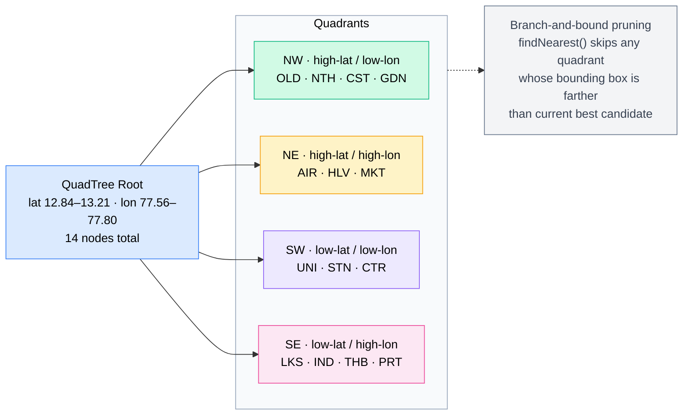

[← Back to README](../README.md)

# Data Structures

- [Graph — Adjacency-List Weighted Graph](#graph--adjacency-list-weighted-graph)
- [QuadTree — Nearest-Node Index](#quadtree--nearest-node-index)
- [Why QuadTree Operations Are O(log N)](#why-quadtree-operations-are-olog-n)
- [POIQuadTree — K-Nearest Search](#poiquadtree--k-nearest-search)
- [QuadTree Spatial Partitioning (Demo City)](#quadtree-spatial-partitioning-demo-city)

---

## Graph — Adjacency-List Weighted Graph

[Graph.java](../graph/Graph.java) stores the road network as an **adjacency list**, which is memory-efficient for the sparse graphs real road maps produce (each intersection touches only a handful of roads).

```
nodes     : Map<String, Node>        id → Node
adjacency : Map<String, List<Edge>>  id → outgoing edges
edgeCount : int                      running total of undirected roads
```

Both maps are `LinkedHashMap`, so iteration order is **insertion order** — deterministic output in the console UI and reproducible benchmarks.

### Bidirectional edges

A road is drivable both ways, so `addEdge` stores **two** directed `Edge` objects — a forward edge in the source's list and a reverse edge in the destination's list — but increments `edgeCount` only **once** ([Graph.java:31](../graph/Graph.java#L31)):

```java
adjacency.get(src.getId()).add(new Edge(src, dest, distance, speedLimit));
adjacency.get(dest.getId()).add(new Edge(dest, src, distance, speedLimit));
edgeCount++;
```

### Operation costs

| Operation | Cost | Why |
|-----------|:----:|-----|
| `addNode` | **O(1)** | one HashMap put + an empty adjacency list |
| `addEdge` | **O(1)** | append to two lists |
| `getNode` / `getNeighbors` | **O(1)** | direct HashMap lookup |
| `getEdgeCount` | **O(1)** | maintained counter, never recomputed |
| `removeNode` | **O(V + E)** | see below |

`removeNode` is the expensive one ([Graph.java:40](../graph/Graph.java#L40)): dropping the node and its own adjacency list is `O(1)` + `O(deg)`, but the reverse edges stored in *other* nodes' lists must be hunted down. That requires scanning every adjacency list:

```java
for (List<Edge> edges : adjacency.values())
    edges.removeIf(e -> e.getDestination().getId().equals(id));
```

Total work touches every node and every edge once → **O(V + E)**. (An adjacency-*map* of neighbor sets could make this `O(deg)`, but for a 14-node demo the simple list is the right call — no premature optimization.)

---

## QuadTree — Nearest-Node Index

[QuadTree.java](../spatial/QuadTree.java) answers *"which node is closest to this lat/lon?"* without scanning every node. It recursively divides a rectangular lat/lon region into **four quadrants** — NW, NE, SW, SE — building a tree whose leaves each hold at most `CAPACITY = 4` points.

### Insertion

```
insert(node):
    if node not inside my bounds        → return false     // not mine
    if I'm a leaf with room (< 4)       → store it, done
    if I'm still a leaf but full        → subdivide()       // split into 4 children
    delegate to whichever child contains the node
```

`subdivide` ([QuadTree.java:114](../spatial/QuadTree.java#L114)) computes the mid-lat/mid-lon, creates the four child quadrants, **re-inserts the 4 buffered points** into them, then clears its own list and flips `divided = true`. From then on the node is an internal router, not a leaf.

### Nearest-neighbor query (branch-and-bound)

The naive answer is an O(N) linear scan. The QuadTree instead **prunes whole quadrants** it can prove are hopeless ([QuadTree.java:89](../spatial/QuadTree.java#L89)):

```java
private void findNearestHelper(double lat, double lon, NearestResult result) {
    // PRUNE: if the closest possible point in this box is already
    // farther than the best we've found, this whole subtree can't help.
    if (distToQuad(lat, lon) >= result.bestDist) return;

    for (Node p : points) {                 // check points held here
        double d = euclideanDist(lat, lon, p.lat, p.lon);
        if (d < result.bestDist) { result.bestDist = d; result.bestNode = p; }
    }
    if (divided) {                          // recurse into all four children
        northwest.findNearestHelper(...);
        northeast.findNearestHelper(...);
        southwest.findNearestHelper(...);
        southeast.findNearestHelper(...);
    }
}
```

`distToQuad` ([QuadTree.java:133](../spatial/QuadTree.java#L133)) is the key: it **clamps** the query point to the quadrant's bounding box and returns the distance to that clamped point — the *minimum possible* distance from the query to anything inside the box. If even that lower bound is ≥ the best distance found so far, the box (and its entire subtree) is skipped.

### Euclidean vs Haversine

The tree compares with plain **Euclidean distance on raw lat/lon degrees** — no trig, cheap, and *order-preserving* for the closely-spaced points of a city-scale bounding box, so it picks the same nearest node a true metric would. Real kilometre distances shown to the user still use the **Haversine** formula ([Main.java:479](../Main.java#L479)); Euclidean is an internal ranking shortcut, not a reported value.

---

## Why QuadTree Operations Are O(log N)

The speedup comes entirely from the tree's **depth** and from **pruning**.

### Tree depth = O(log N)

Each subdivision splits a region into 4 and distributes its points among the children. With `N` roughly-uniform points and a leaf capacity `C`, the number of points in a subtree drops by a factor of ~4 at every level, so the tree bottoms out after

```
depth ≈ log₄(N / C) = O(log N)
```

levels. (Analogous to a balanced BST being `log₂ N` deep — a QuadTree is a 4-way spatial version.)

### Insert = O(log N) average

An insert walks **one** root-to-leaf path — one `contains` test per level — so it costs `O(depth) = O(log N)`.

### Nearest neighbor = O(log N) average

Two phases:
1. **Descend** to the leaf containing the query point — `O(log N)`. This gives a good first candidate quickly.
2. **Backtrack**, using `distToQuad` to prune. For roughly-uniform points, only a **constant number** of neighbouring quadrants can hold anything closer than that first candidate — every other subtree fails the `distToQuad ≥ bestDist` test and is skipped in `O(1)`.

Total nodes visited stays proportional to the depth → **O(log N)** on average, versus O(N) for a linear scan. The [benchmarks](05-performance.md) show this as an **11.9× speedup at N = 100,000**.

### Worst case = O(N)

Pruning only helps when the points *separate* into different quadrants. If many points are **co-located or heavily clustered**, subdivision keeps sending them into the same child, the tree grows lopsided/deep instead of branching, and few quadrants can be pruned — degrading toward a full O(N) traversal. This is why the payoff is invisible on the 14-node demo (tree overhead > scanning 14 items) but dominates at city scale, where points are spread across the map.

---

## POIQuadTree — K-Nearest Search

[POIQuadTree.java](../spatial/POIQuadTree.java) is the same spatial tree, specialised to return the **K nearest** Points of Interest instead of a single nearest. The engine keeps **one tree per category** (HOTEL, RESTAURANT, MALL, THEATRE) so a "nearest hotels" query never wastes time on restaurants ([NavigationSystem.java:41](../engine/NavigationSystem.java#L41)).

### The size-K max-heap

The search maintains a **max-heap of at most K entries**, ordered so the *farthest* of the current K sits on top:

```java
// POIQuadTree.java:61 — farthest-first ordering
PriorityQueue<Map.Entry<Double, PointOfInterest>> maxHeap =
    new PriorityQueue<>((a, b) -> Double.compare(b.getKey(), a.getKey()));
```

Per candidate POI:
- heap has **fewer than K** entries → just add it;
- otherwise, if the candidate is **closer than the current farthest** (`heap.peek()`), evict the top and add the candidate.

`peek()` is always the K-th best so far, which doubles as the **pruning radius**:

```java
// POIQuadTree.java:76 — skip a subtree that can't beat the current K-th best
if (maxHeap.size() >= k && distToQuad(lat, lon) >= maxHeap.peek().getKey()) return;
```

### Why the entry is a `Map.Entry<Double, PointOfInterest>`

Each heap entry pairs the **distance with the POI itself**. Eviction is then a single atomic `poll()` in `O(log K)` — the removed POI leaves with its distance. An earlier version kept the distances in the heap and the POIs in a **parallel list**, so eviction needed an `O(K)` scan to find the matching POI by distance — and silently removed the wrong POI when two were equidistant. Storing them together fixed that bug (commit `5e99f26`). A final ascending sort orders the K results nearest-first for display ([POIQuadTree.java:67](../spatial/POIQuadTree.java#L67)).

### Complexity

Same reasoning as the QuadTree: `O(K log N)` average — descend + pruned backtrack, with each heap operation costing `O(log K)`. Worst case `O(N)` under heavy clustering.

---

## QuadTree Spatial Partitioning (Demo City)

How the 14-node city is divided into quadrants for nearest-node lookup.


